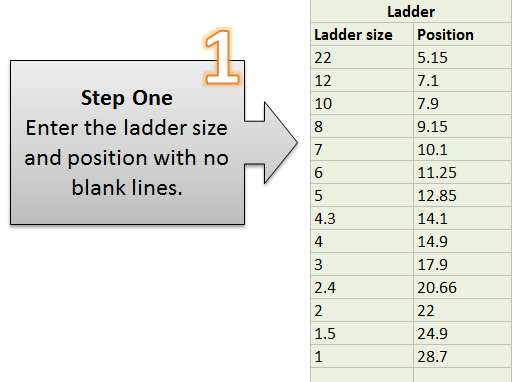
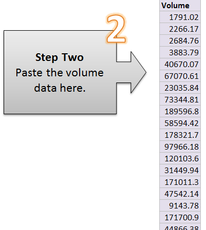
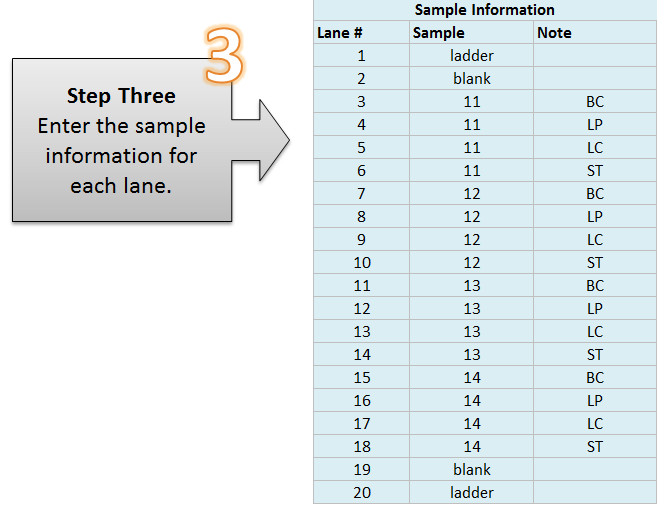
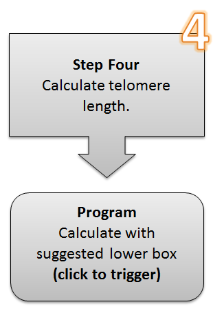
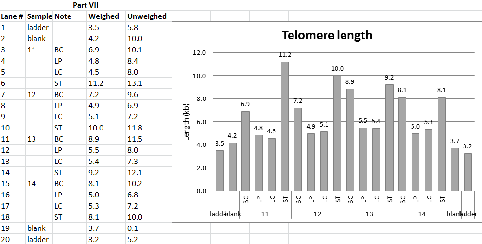

Telomere length analyzer
========================

## Application
This Excel script calculates the mean telomere length from a telomeric restriction fragmentation (TRF) Southern blot image. Currently, the maximum number of lanes it can process is **20**.

## Analysis setup
#### Step 0
Evenly partition each lane on the gel image to 30 parts, and measure the color / shade intensity from any gel image software.

#### Step 1
Determine the position of the size ladders / markers in terms of the partition. Set the position of each ladder / marker band in the "Ladders" input region.

#### Step 2
Combine all the intensity data into one column, and copy to the "Volumn" input region.

#### Step 3
Setup the sample information in the next input region.

#### Step 4
Run the script by clicking the button in the fourth section.

## Result
After running the script, three result sheets will be generated.

#### Section II
An overview of the ladder and sample information you have setup in Section I.

#### Section III
The detailed information about the telomere length calculation for each lane.

#### Section IV
A summary of the sample telomere length.

## Copyright
This Excel VBA script program was developed while I was working in laboratory of [Dr. David Gilley](http://genetics.medicine.iu.edu/faculty/david-p-gilley-ph-d/) in Indiana University, School of Medicine, Indianapolis. It was improved based on the [TeloRun](http://www4.utsouthwestern.edu/cellbio/shay-wright/research/sw_lab_methods.htm) program developed in the laboratory of [Dr. Jerry Shay and Dr. Woodring Wrigth](http://www4.utsouthwestern.edu/cellbio/shay-wright/) in University of Texas Southwestern Medical Center.

